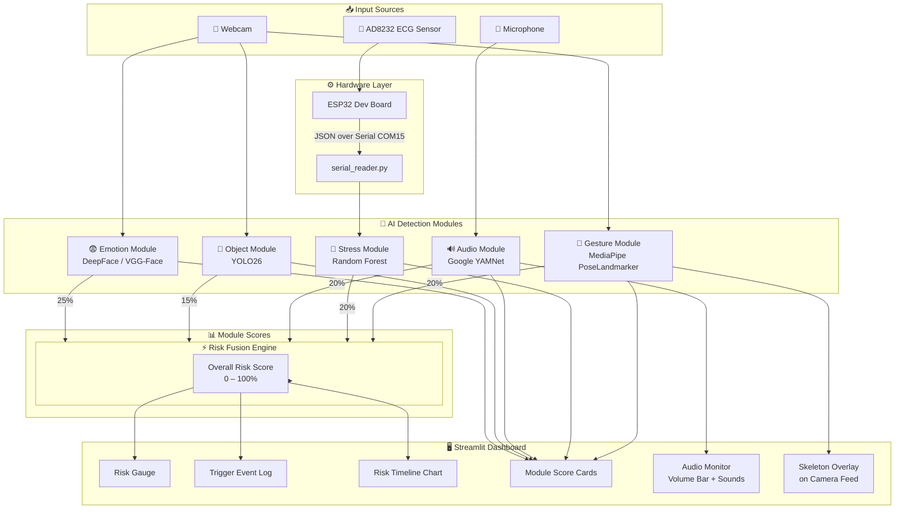
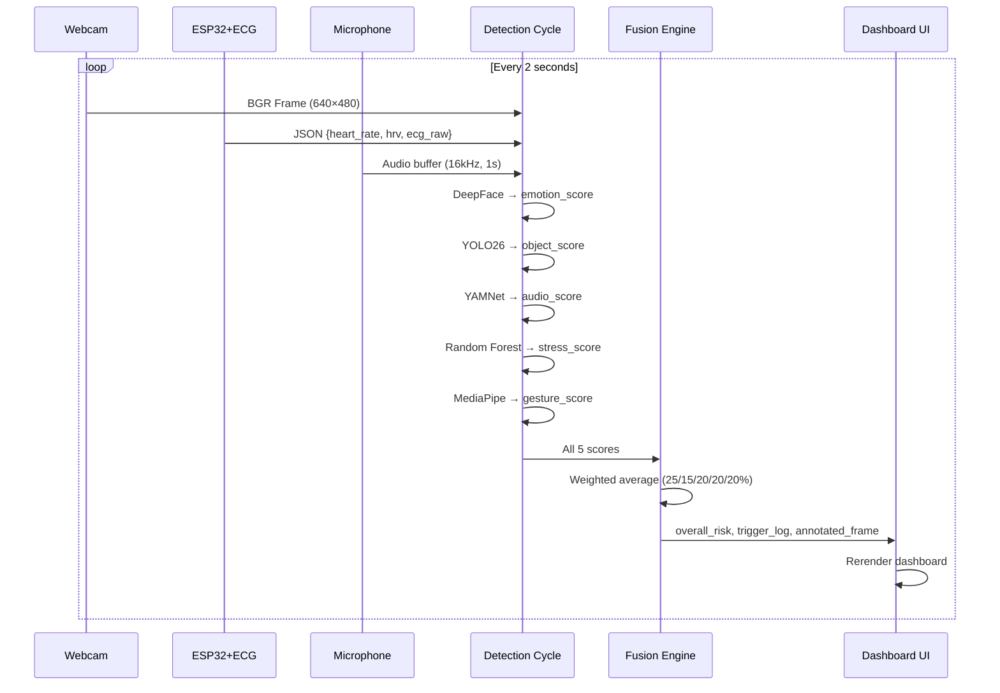
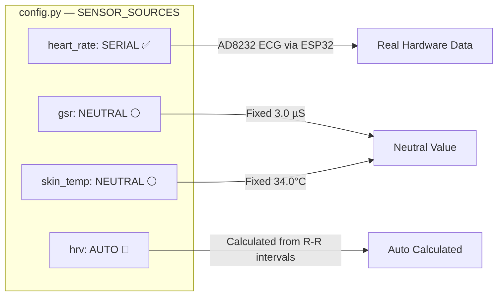

# 🧠 PTSD Sentinel — AI-Based PTSD Trigger Detection System

> A real-time multi-modal PTSD trigger detection system using computer vision, audio analysis, physiological sensors, and machine learning — built as a Minor Project for B.Tech.


---

## 📋 Table of Contents

- [Overview](#overview)
- [System Architecture](#system-architecture)
- [Modules](#modules)
- [Hardware Setup](#hardware-setup)
- [Project Structure](#project-structure)
- [Installation](#installation)
- [Configuration](#configuration)
- [Running the System](#running-the-system)
- [Dashboard](#dashboard)
- [Tech Stack](#tech-stack)

---

## Overview

**PTSD Sentinel** monitors a patient in real time through a webcam and microphone, analyzing five independent channels to detect potential PTSD trigger responses:

| Channel | Technology | What it detects |
|---------|-----------|-----------------|
| 😨 **Facial Emotion** | DeepFace (VGG-Face) | Fear, anger, sadness, disgust |
| 🎯 **Object Detection** | YOLO26 (Ultralytics) | Weapons, vehicles, crowds |
| 🔊 **Audio** | Google YAMNet | Gunshots, sirens, screaming, explosions |
| 💓 **Physiological** | AD8232 ECG + ESP32 | Heart rate, HRV from real ECG |
| 🤜 **Gesture** | MediaPipe PoseLandmarker | Fighting stance, trembling, defensive posture |

All five scores are fused by a weighted risk engine into a single **Overall Risk Score (0–100%)** displayed on the dashboard.

---

## System Architecture



### Data Flow Detail



### Sensor Source Config



---

## Modules

### 😨 Emotion Module (`src/emotion/`)
- **Model:** DeepFace with VGG-Face backend
- **Input:** 640×480 BGR webcam frame
- **Detects:** fear, anger, sadness, disgust → PTSD triggers
- **Output:** `trigger_score` (0–100), dominant emotion
- **Demo:** `python src/emotion/detector.py`

### 🎯 Object Detection Module (`src/object_detection/`)
- **Model:** YOLO26 Nano (`yolo26n.pt`) — Ultralytics
- **Input:** 640×480 BGR webcam frame
- **Detects:** knives, guns, vehicles, crowds (>5 people)
- **Output:** `trigger_score` (0–100), list of trigger objects
- **Demo:** `python src/object_detection/detector.py`

### 🔊 Audio Module (`src/audio/`)
- **Model:** Google YAMNet (TensorFlow Hub)
- **Input:** 16kHz mono audio, 1-second chunks
- **Detects:** gunshots, sirens, screaming, explosions, alarms
- **Output:** `trigger_score`, top sounds, volume level (0–100%)
- **Demo:** `python src/audio/classifier.py`

### 💓 Stress Module (`src/stress/`)
- **Model:** Random Forest (scikit-learn, trained on 3000 samples)
- **Features:** heart rate, GSR, HRV, skin temperature
- **Data sources:** AD8232 ECG (real) or simulated dummy data
- **Output:** stress level (calm / mild_stress / high_stress), trigger_score
- **Demo:** `python src/stress/classifier.py`
- **Hardware test:** `python src/stress/hardware_test.py`

### 🤜 Gesture Module (`src/gesture/`)
- **Model:** MediaPipe PoseLandmarker (`pose_landmarker_lite.task`)
- **Input:** 640×480 BGR webcam frame → 33 body landmarks
- **Detects:**

| Gesture | Risk | Category |
|---------|------|----------|
| Fighting Stance | 0.90 | Aggression |
| Head Covering | 0.85 | Distress |
| Crouching | 0.80 | Fear |
| Trembling | 0.75 | Fear |
| Defensive Posture | 0.60 | Defense |
| Hand Rubbing | 0.50 | Anxiety |
| Face Touching | 0.40 | Anxiety |

- **Demo:** `python src/gesture/detector.py`

---

## Hardware Setup

### Components Required

| Component | Purpose | Price |
|-----------|---------|-------|
| ESP32 Dev Board (CP2102 USB-C) | Microcontroller & serial bridge | ~₹299 |
| AD8232 ECG Heart Monitor | Measures heart rate & HRV | ~₹300 |
| ECG Electrode Pads (3x) | Skin contact (included with AD8232) | — |
| Jumper Wires (F-to-M) | Connections | ~₹50 |
| **Total** | | **~₹650** |

### Wiring Diagram

```
AD8232 Board          ESP32 Dev Board
─────────────         ──────────────────
GND      ──────────→  GND
3.3V     ──────────→  3V3
OUTPUT   ──────────→  D34  (Analog ECG signal)
LO-      ──────────→  D18  (Lead-off detection)
LO+      ──────────→  D19  (Lead-off detection)
SDN      ──          (not connected)
```

### Electrode Placement

```
        [Right Collarbone]        [Left Collarbone]
               🔴 Red (RA)           🟡 Yellow (LA)


                        [Lower Left Abdomen]
                              🟢 Green (RL)
```

### ESP32 Arduino Code
File: `hardware/ecg_esp32/ecg_esp32.ino`

Upload using Arduino IDE:
1. Install ESP32 board package (Board Manager URL: `https://espressif.github.io/arduino-esp32/package_esp32_index.json`)
2. Select: **Tools → Board → ESP32 Dev Module**
3. Select: **Tools → Port → COM15** (or your port)
4. Click **→ Upload**

**Serial output format (JSON at 115200 baud):**
```json
{"heart_rate": 72.3, "hrv": 35.2, "ecg_raw": 2450, "leads_off": false}
```

---

## Project Structure

```
PTSD3/
│
├── dashboard/
│   └── app.py                  ← Streamlit dashboard (main UI)
│
├── src/
│   ├── emotion/
│   │   └── detector.py         ← DeepFace emotion detection
│   │
│   ├── object_detection/
│   │   └── detector.py         ← YOLO26 object detection
│   │
│   ├── audio/
│   │   └── classifier.py       ← YAMNet audio classification
│   │
│   ├── stress/
│   │   ├── classifier.py       ← Random Forest stress classifier
│   │   ├── dummy_data.py       ← Simulated sensor data
│   │   ├── serial_reader.py    ← ESP32 serial reader (hybrid)
│   │   └── hardware_test.py    ← Standalone ECG hardware test ⭐
│   │
│   ├── gesture/
│   │   ├── detector.py         ← MediaPipe gesture detector
│   │   └── gesture_config.yaml ← Gesture risk weights
│   │
│   ├── fusion/
│   │   └── engine.py           ← Risk fusion engine
│   │
│   └── utils/
│       ├── config.py           ← All settings (sensor sources, weights)
│       └── logger.py           ← Logging setup
│
├── hardware/
│   └── ecg_esp32/
│       └── ecg_esp32.ino       ← Arduino code for ESP32 + AD8232
│
├── models/
│   ├── stress_classifier.pkl   ← Trained Random Forest model
│   └── pose_landmarker.task    ← MediaPipe pose model
│
├── data/
│   └── stress_dataset.csv      ← Training data (3000 samples)
│
├── requirements.txt
└── README.md
```

---

## Installation

### 1. Clone / Open Project
```bash
cd c:\Users\hp\Desktop\PTSD\PTSD3
```

### 2. Create Virtual Environment
```bash
python -m venv venv
.\venv\Scripts\activate
```

### 3. Install Dependencies
```bash
pip install -r requirements.txt
pip install mediapipe pyserial
```

### 4. Download MediaPipe Pose Model
```bash
python -c "
import urllib.request
urllib.request.urlretrieve(
    'https://storage.googleapis.com/mediapipe-models/pose_landmarker/pose_landmarker_lite/float16/latest/pose_landmarker_lite.task',
    'models/pose_landmarker.task'
)
print('Downloaded!')
"
```

### 5. Train Stress Classifier
```bash
.\venv\Scripts\python.exe src/stress/classifier.py
```

---

## Configuration

All settings are in **`src/utils/config.py`**:

### Sensor Sources
```python
SENSOR_SOURCES = {
    "heart_rate": "SERIAL",   # "SERIAL" = real ECG | "DUMMY" = simulated
    "gsr":        "NEUTRAL",  # No GSR hardware — uses neutral value
    "hrv":        "AUTO",     # Auto-calculated from ECG R-R intervals
    "skin_temp":  "NEUTRAL",  # No temp sensor — uses neutral value
}

SERIAL_PORT = "COM15"         # Your ESP32 COM port (check Device Manager)
```

### Fusion Weights
```python
FUSION_WEIGHTS = {
    "emotion": 0.25,   # 25% — facial emotion
    "object":  0.15,   # 15% — detected objects
    "audio":   0.20,   # 20% — trigger sounds
    "stress":  0.20,   # 20% — physiological
    "gesture": 0.20,   # 20% — body gestures
}
```

### Quick Modes

| Scenario | `heart_rate` | `gsr` | Description |
|----------|-------------|-------|-------------|
| No hardware | `DUMMY` | `DUMMY` | Fully simulated |
| ECG only ✅ | `SERIAL` | `NEUTRAL` | Real HR, rest neutral |
| Full hardware | `SERIAL` | `SERIAL` | All real (future) |

---

## Running the System

### Option 1: Full Dashboard
```bash
# Make sure ESP32 is connected and Arduino Serial Monitor is CLOSED
.\venv\Scripts\streamlit run dashboard\app.py
```

### Option 2: Test Individual Modules
```bash
# Test ECG hardware
.\venv\Scripts\python.exe src\stress\hardware_test.py

# Test gesture detection
.\venv\Scripts\python.exe src\gesture\detector.py

# Test audio classification
.\venv\Scripts\python.exe src\audio\classifier.py

# Test emotion detection
.\venv\Scripts\python.exe src\emotion\detector.py
```

> ⚠️ **Important:** Close Arduino IDE Serial Monitor before running the dashboard — only one program can use the COM port at a time.

---

## Dashboard

The Streamlit dashboard runs at `http://localhost:8501` and shows:

```
┌─────────────────────────────────────────────────────────┐
│  🧠 PTSD SENTINEL                    ▶ Start  ■ Stop    │
├──────────┬──────────┬──────────┬──────────┬─────────────┤
│ 😨 Emotion│🎯 Objects│🔊 Audio  │💓 Stress │🤜 Gesture   │
│   45%    │   12%   │   67%    │   38%   │    55%      │
├──────────┴──────────┴──────────┴──────────┴─────────────┤
│  📷 Camera Feed          │  🎯 Risk Gauge               │
│  (with skeleton overlay) │      ████ 52%                │
│                          │  📈 Risk Timeline            │
│                          │  💓 HR Timeline              │
├──────────────────────────┴──────────────────────────────┤
│  🔊 Audio Monitor                                        │
│  Volume: ████████░░ 78%   Detected: Siren (92%)          │
├─────────────────────────────────────────────────────────┤
│  📋 Event Log                                           │
│  12:34:01  ⚠️ Risk 67% — fear, mild_stress              │
│  12:33:55  🔊 Sound trigger: Siren                      │
│  12:33:50  🤜 Gesture: Head Covering                    │
└─────────────────────────────────────────────────────────┘
```

---

## Tech Stack

| Layer | Technology |
|-------|-----------|
| **Language** | Python 3.10+ |
| **Dashboard** | Streamlit + Plotly |
| **Face Emotion** | DeepFace (VGG-Face backend) |
| **Object Detection** | Ultralytics YOLO26 |
| **Audio** | TensorFlow Hub YAMNet |
| **Gesture** | Google MediaPipe Tasks API |
| **Stress ML** | scikit-learn Random Forest |
| **Hardware** | ESP32 + AD8232 ECG |
| **Serial Comm** | pyserial |
| **Computer Vision** | OpenCV |
| **Config** | PyYAML |

---

## Team

> Minor Project — B.Tech
> PTSD Trigger Detection System using Multi-Modal AI

---

*Built with ❤️ using Python, TensorFlow, MediaPipe, and ESP32*
